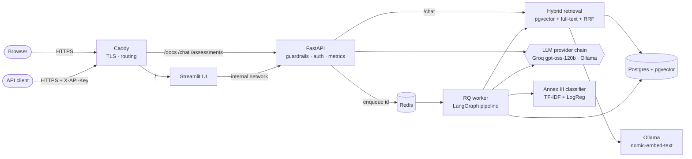
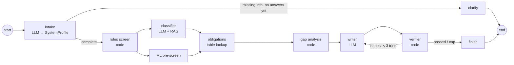
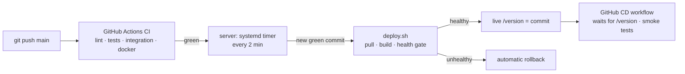

# Build process: EU AI Act Compliance Copilot

How the project was built, phase by phase, from an empty starter template to a live, continuously
deployed system: the architecture at each stage, the tools, models and skills involved, the
decisions and trade-offs, and what went wrong and was fixed along the way.

- **Live:** [ai-act-copilot.duckdns.org](https://ai-act-copilot.duckdns.org) (web UI) ·
  [/docs](https://ai-act-copilot.duckdns.org/docs) (API)
- **Timeline:** 26–30 September 2026 · 24 commits on `main`
- **Scope:** built on a structured starter template. The scaffolding (Docker/Compose, FastAPI app
  factory, database access, workflows) was provided; the core logic (retrieval, RAG, agents, MLOps,
  LLMOps, metrics) was implemented phase by phase, each phase defined by its tests. Everything under
  "Beyond the phases" (fixes from error analysis, deployment, UI in production, CD) was added on top.

---

## 1. Final architecture

**Assessment pipeline (LangGraph):**

**Delivery pipeline:**

**Design principle throughout:** *the LLM handles language and judgement; code handles rules, facts
and verification.* Screening rules, obligations, deadlines, gap priorities, citation checks and the
report disclaimer are deterministic; the LLM reads descriptions, applies the law and writes text,
and its output is checked in code.

---

## 2. Technology stack

| Layer | Technology | Used for |
|---|---|---|
| Language & tooling | Python 3.12, **uv** (deps, lockfile), ruff (lint/format), mypy, pytest, pre-commit | development workflow |
| API | **FastAPI**, Pydantic, uvicorn | REST API, validation, OpenAPI docs, SSE streaming |
| Agents | **LangGraph** | stateful multi-agent graph with branches, parallel fan-out/fan-in, bounded loop |
| Retrieval store | **PostgreSQL 16 + pgvector** (HNSW index), Postgres full-text search (GIN, `tsvector`) | vector + keyword search in one database |
| Jobs | **Redis + RQ** | background assessments (202 + polling/SSE) |
| ML | **scikit-learn** (TF-IDF, logistic regression), **MLflow** (tracking, registry, aliases), NumPy | Annex III classifier, promotion gate, PSI drift |
| LLM access | Ollama, OpenAI-compatible API (**Groq**), Anthropic/OpenAI SDKs | provider abstraction + fallback chain |
| Observability | **Prometheus** client (counters, histograms), Grafana | golden signals + tokens/cost per provider |
| UI | **Streamlit** | web front end for chat and assessments |
| Containers | **Docker** (multi-stage, non-root, healthcheck), **Docker Compose** | local 7-service stack, production stack |
| Edge | **Caddy** | reverse proxy, automatic Let's Encrypt HTTPS, path routing |
| CI/CD | **GitHub Actions**, systemd timer, `deploy.sh` | CI (lint, tests, integration, image build, eval gate), pull-based CD with rollback |
| Hosting | **Oracle Cloud Always Free** (Ampere ARM VM, Frankfurt), **DuckDNS** | $0 production hosting and a free domain |
| Load testing | Locust | (prepared, not yet run) |

## 3. Models

| Model | Where | Role | Notes |
|---|---|---|---|
| `llama3.1:8b` | Ollama on the Mac (Apple GPU) | development LLM | eval baseline **15%**; weak structured output, over-classifies as high-risk, occasional timeouts |
| `llama3.2` (3B) | Ollama, local | available for low-RAM use | not used for results |
| **`openai/gpt-oss-120b`** | **Groq free tier** (OpenAI-compatible API) | production LLM (intake, classifier, writer, chat) | **3/3** on an eval spot check, incl. two scenarios the 8B failed; free-tier limits 30 RPM, 8k TPM, 200k TPD |
| **`nomic-embed-text`** | Ollama (Mac GPU locally, VM CPU in production) | embeddings, **768 dimensions** (matches `vector(768)`) | `kind="query"` vs document prefixes |
| TF-IDF + logistic regression | scikit-learn, tracked in MLflow | Annex III area classifier (second opinion) | macro F1 **0.22 → 0.73** after data work |
| `HashEmbedder`, `FakeProvider` | tests | deterministic fakes | unit tests run with no services or network |

**Prompts** are versioned YAML files (`prompts/`: `intake`, `classifier`, `rag_answer`, `writer`);
every chat answer returns its `prompt_version`.

---

## 4. Phase by phase

### Phase 0 · Setup and provided infrastructure (26 Sep)
- **Did:** installed uv, ran `make setup` (dependencies, pre-commit, `.env`), passed the Phase 0 tests,
  pulled the Ollama models, pushed the repo to GitHub (after fixing Git authentication with the
  GitHub CLI and a root-owned `~/.config`).
- **Fixed:** `docker-compose.yml` hard-coded the Ollama container address, so the stack couldn't use
  the native Mac Ollama app (the only one with GPU access). Made it configurable (`DOCKER_OLLAMA_HOST`).
- **Skills:** Git over HTTPS with tokens/`gh`, file permissions, reading a starter codebase.

### Phase 1 · Parsing, chunking, ingestion (26 Sep)
- **Built:** `parse_act` (a line-by-line state machine: skip recitals, detect `CHAPTER`/`Article`/`ANNEX`
  headings with anchored regexes, "next line is the title" flags, de-duplicate repeated headings),
  `split_paragraphs` (group lines at numbered paragraphs), `chunk_provision` (pack paragraphs up to
  1,800 characters, split overlong ones at sentence ends, prepend a context header).
- **Result:** the real Act ingested as **113 articles + 13 annexes → 292 chunks**; idempotent
  re-ingestion (deterministic ids + content hashes → `0 new/changed`).
- **Hit:** EUR-Lex returned an empty page to scripts (bot protection) → saved the page in a browser and
  ingested from file.
- **Skills:** regex, state machines, dataclasses, structure-aware chunking, contextual chunk headers,
  idempotency.

### Phase 2 · Hybrid retrieval and metrics (26 Sep)
- **Built:** Reciprocal Rank Fusion, `hybrid_search` (vector + keyword, one lookup dict instead of extra
  DB calls, optional cross-encoder reranker), `recall_at_k`, `mrr`.
- **Result (25 questions):** recall@5 keyword 0.42 · vector 0.90 · **hybrid 0.90**; MRR 0.771 → **0.788**.
- **Bugs fixed:** set intersection missing in recall; passing RRF's damping constant `k` as a top-k.
- **Skills:** information retrieval, rank fusion, retrieval evaluation, set operations.

### Phase 3 · Grounded answers, guardrails, `/chat` (26–27 Sep)
- **Built:** XML-delimited prompt with numbered documents (question last), citation extraction
  (`[2]`, `[1][3]`, `[1, 3]`), citation validation (≥ 1 citation, all in range), `answer_question`,
  input guardrails (empty, length, prompt injection), PII redaction (email, IBAN, phone, order matters),
  the `POST /chat` endpoint.
- **Bugs fixed:** `all([])` is `True` (uncited answers passed); `\b` before `+` never matches; using the
  OpenAI response shape instead of the provider abstraction's `LLMResult`.
- **Hit:** the semantic-cache dependency returned an object before it was implemented → temporarily
  disabled the cache calls; slow local LLM → timeout tuning.
- **Skills:** grounded generation, hallucination detection in code, prompt injection (OWASP LLM01),
  GDPR data minimisation, FastAPI dependency injection.

### Infrastructure lessons I1–I3 · Docker, Compose, FastAPI (27 Sep)
- **Docker:** multi-stage build, layer caching (71.8 s → 11.7 s rebuild), non-root user, healthcheck,
  `localhost` inside a container, `EXPOSE` vs `-p`.
- **Compose:** fixed two host-port conflicts (MLflow vs macOS AirPlay on 5000 → 5001; Ollama behind a
  profile), a worker inheriting the API's HTTP healthcheck (gave it a Redis check), a failing image
  pull (stale `ghcr.io` login), YAML anchors, named volumes vs bind mounts.
- **FastAPI:** request lifecycle, app factory, routers, router-level API-key auth, `Depends` +
  `@lru_cache`, `dependency_overrides` for tests; added `GET /stats`.
- **Also:** ruff B008 false positive for FastAPI `Depends` → configured `extend-immutable-calls`.

### Phase 4 · Rules, intake agent, classifier agent (27 Sep)
- **Built:** deterministic screening rules (`screen`), the intake agent (free text → validated
  `SystemProfile` via structured output, clarifications, a provider/deployer question), and the
  classifier as an **agentic workflow**: query planning → de-duplicated retrieval → structured
  classification → verification in code (drop unsupported citations, flag rule/LLM disagreement,
  cap confidence when facts are missing, fill the role).
- **Bugs fixed:** the order trap (flag added after sorting), `len()` of an int, reading a field from the
  wrong model, **de-duplicating by `provision_id` instead of chunk `id`** (tests passed, the code was
  still wrong; only the first chunk of each article would reach the classifier).
- **Skills:** structured output with Pydantic + retries, human-in-the-loop, workflow vs free agent,
  defence in depth for LLM output.

### Infrastructure lesson I4 · Postgres and pgvector (27 Sep)
- Inspected the schema with `psql`: HNSW (approximate nearest neighbours, cosine) and GIN (full-text)
  indexes; `EXPLAIN` showed a sequential scan (correct at 292 rows); similarity scores bunched at
  0.88–0.91 (why ranks beat scores, why cache thresholds must be strict); wrote `GROUP BY` queries.

### Phase 5 · LangGraph orchestration (27 Sep)
- **Built:** obligations lookup (curated table, unknown role shows both sides), gap analysis (status,
  deadline-based priority, stable sort), the report verifier (collect **all** issues), routing
  functions, and the graph (conditional edges, parallel classify/ML fan-out with a list-edge join,
  bounded write ↔ verify loop).
- **Bugs fixed:** priority strings sorted alphabetically; **29 February** crash from
  `date.replace(year+1)`; early return in the verifier (a 4-issue report could never pass in 3 tries).
- **Error analysis on a real run:** the verifier rejected a correct report (paraphrased "not legal
  advice") three times → **the disclaimer is now appended in code**: 3 attempts → 1, assessment
  **5 min 29 s → 2 min 22 s (−57%)**. The same run showed "right category, wrong legal route, no
  citations" and a fabricated quote.

### Infrastructure lesson I5 · Redis and job queues (27 Sep)
- 202 Accepted + background worker; the **claim-check pattern** (Redis holds only the id, Postgres the
  data). Experiments: the queue holds jobs while the worker is down; **a worker killed mid-job leaves
  the assessment `running` forever**. Layered fixes identified (reconciler, retries with idempotency,
  failure callback, graceful shutdown, checkpointing); at-most-once vs at-least-once delivery.

### Phase 6 · MLOps (27 Sep)
- **Built:** TF-IDF + logistic regression pipeline, macro-F1/per-class evaluation, the promotion gate
  (minimum F1, must beat the champion, no per-class regression), PSI drift (numeric and categorical).
- **Data work:** 52 seed rows gave macro F1 **0.22 → rejected by the gate**. Generated 270 synthetic
  rows with the local LLM, then **reviewed every row** (43 relabelled using the Act's own exclusions,
  72 removed incl. 40 near-duplicates that would leak between train and test) → **0.73 → promoted**.
  Audit script and model card committed with the data.
- **Skills:** data-centric ML, metric choice under imbalance, data leakage, model registry, drift.

### Phase 7 · LLMOps (28 Sep)
- **Built:** eval scoring (category, Annex III area, transparency, citation recall; `None` ≠ `False`),
  aggregation, LLM-as-judge agreement (accuracy/TPR/TNR), the semantic cache (cosine ≥ 0.95, TTL, size
  cap), provider fallback (streams only fall back before the first token).
- **Eval-driven improvement:** baseline **0/12 → 15% (3/20)**. Tested the hypothesis "the verifier drops
  citations" **before** fixing: rejected. Real causes: the classifier left the area and citations
  empty. Fixes: keep the intake's area; recover citations named in the reasoning **only if retrieved**
  (flagged). Then rule gaps: transparency from the rules (**0% → 100%** on the affected scenarios), GPAI
  and unsupported high-risk checks, more Article 5 prohibitions, and a safety floor for prohibited
  practices. **A fix that made things worse** (GPAI override turned an image app into "GPAI") was
  narrowed to prohibited practices only.
- **Skills:** evals as the development loop, error analysis, failure taxonomies, cost asymmetry of
  errors, caching risk, reliability patterns.

### Phase 8 · Observability and CI/CD (28 Sep)
- **Built:** metrics middleware (route templates to keep cardinality low, 500 on exceptions, `/metrics`
  excluded) and LLM token/cost/latency metrics.
- **Fixed:** an order-dependent test (env setup moved to `tests/conftest.py`), which exposed a production
  bug: invalid ids gave **500 instead of 404**.
- **CI turned green for the first time:** the workflow only triggered on `main` (repo used `master`);
  31 never-formatted files and 5 lint errors; **two ruff versions** (pre-commit 0.6.9 vs lockfile 0.16.9)
  undoing each other. Result: lint ✓ unit tests ✓ integration (real Postgres + Redis service
  containers) ✓ docker build ✓.
- **Repo hygiene:** rewrote history once (machine-local author emails, `CLAUDE.md`), with a backup
  branch and `--force-with-lease`.

### Beyond the phases: deployment, UI, CD (28–30 Sep)
- **Production stack** (`docker-compose.prod.yml`): Caddy with automatic HTTPS, only ports 80/443
  public, Postgres/Redis internal only, `APP_ENV=prod` requires an API key, Redis persistence, memory
  limits, and a fail-fast MLflow lookup. Caught before it happened: `.gitignore` would have committed
  `.env.prod`.
- **Hosting at $0:** Oracle Cloud Always Free (Ampere ARM VM, Frankfurt) with two firewall layers
  (security list + iptables), SSH restricted to one IP; Groq's free tier via the OpenAI-compatible
  API (no code change); a free DuckDNS name.
- **Web UI in production:** Streamlit behind Caddy (`/` → UI, API paths → FastAPI, `/metrics` blocked);
  the UI calls the API internally, so users never see the key. Fixed the Streamlit feedback buttons
  (reruns → `session_state`), a stale single-file bind mount, and Caddy's directive order.
- **Continuous deployment, pull-based:** a systemd timer runs `deploy/deploy.sh` every 2 minutes;
  only commits with green CI deploy; health gate (containers healthy + public `/version` shows the
  commit); automatic rollback; the GitHub CD workflow verifies and smoke-tests the live site. Chosen
  over push-based SSH so the server needs no inbound access and GitHub holds no credentials.

---

## 5. Results

| Metric | Value |
|---|---|
| Corpus | 113 articles + 13 annexes → 292 chunks |
| Retrieval recall@5 / MRR (25 questions) | 0.42 keyword → **0.90** hybrid / 0.771 → **0.788** |
| Classifier macro F1 | 0.22 (seed) → **0.73** (reviewed data, promoted) |
| Scenario pass rate, `llama3.1:8b` (20 scenarios) | **15%** baseline; transparency on affected scenarios 0% → 100% after fixes |
| `gpt-oss-120b` on Groq (spot check) | **3/3** |
| Assessment wall time (same input, local 8B) | 5 min 29 s → **2 min 22 s** |
| Tests | **64 unit tests** + integration tests against real Postgres/Redis; CI green |
| Hosting cost | **$0** |

## 6. Skills practised

- **AI engineering:** RAG end to end (parsing, chunking, embeddings, hybrid retrieval, grounding,
  citation verification), multi-agent orchestration, structured output, human-in-the-loop, guardrails.
- **Evaluation:** retrieval metrics, scenario evals, LLM-as-judge validation, error analysis, measuring
  every fix (including one that regressed).
- **MLOps:** data review and provenance, training/evaluation, experiment tracking, registry + promotion
  gate, drift detection, model cards.
- **LLMOps:** prompt versioning, provider abstraction and fallback, semantic caching, cost/latency
  awareness, rate limits.
- **Backend:** FastAPI, Pydantic, dependency injection, background jobs, SSE, Postgres/SQL, Redis.
- **DevOps:** Docker, Compose, CI with service containers, pull-based CD with rollback, systemd,
  reverse proxy and TLS, cloud networking and firewalls, secrets handling, Git (history rewriting,
  pinning tool versions).
- **Debugging habits:** read the last frame of the traceback, test a hypothesis before fixing, use each
  tool's own checker (`compose config`, `caddy adapt`, `systemd-analyze verify`), "timeout vs refused".

## 7. Open items

- Full 20-scenario eval with `gpt-oss-120b` (the "current" pass rate)
- Load test (p95 latency, throughput) against the live site, within Groq's rate limits
- Demo GIF in the README
- Reliability: a reconciler for jobs stuck in `running`; `done_with_issues` when the retry cap is hit
- Observability in production: scrape the worker, multiprocess metrics, alerts
- Two prohibited-practice scenarios timed out with the local 8B (re-test with the hosted model)
- Stretch: Kubernetes (k3s on the same VM), Helm, Terraform for the Oracle resources

See also: [README.md](README.md) (overview and results), [docs/DEPLOY.md](docs/DEPLOY.md) (runbook
for deployment and CD), [docs/MODEL_CARD.md](docs/MODEL_CARD.md) (classifier data and evaluation),
[docs/BLUEPRINT.md](docs/BLUEPRINT.md) (original design).
