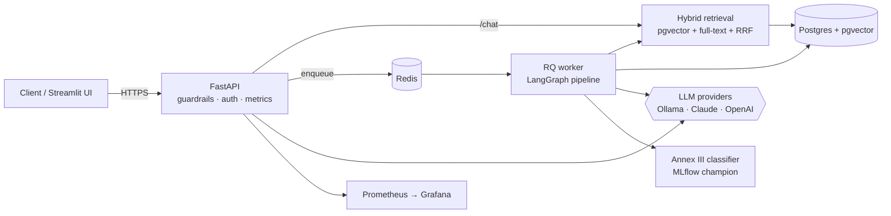
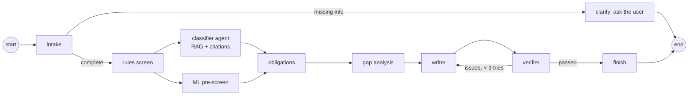

# EU AI Act Compliance Copilot

[](https://github.com/arjityadav/ai-act-copilot/actions/workflows/ci.yml)

**Multi-agent RAG system that classifies AI systems under the EU AI Act and maps obligations, deadlines and gaps, built end to end from ingestion to production.**

FastAPI · LangGraph · PostgreSQL + pgvector · Redis/RQ · Ollama / Claude / OpenAI · scikit-learn + MLflow · Docker · GitHub Actions · Prometheus + Grafana

**Live demo:** [ai-act-copilot.duckdns.org](https://ai-act-copilot.duckdns.org): ask the AI Act or assess an AI system in the web UI (Streamlit). API docs: [/docs](https://ai-act-copilot.duckdns.org/docs); calling the API directly requires an API key. Deployed on Oracle Cloud (Always Free, Frankfurt) with `openai/gpt-oss-120b` on Groq's free tier, so it can be slow or rate-limited under load; see [docs/DEPLOY.md](docs/DEPLOY.md).

> Decision support, not legal advice. Every answer cites the regulation; every report is verified in code and must be reviewed by a qualified person.

<!-- TODO: demo GIF (an assessment streaming its progress events, or /chat answering with citations) -->

## What it does

- **Ask the AI Act**: questions answered only from the regulation, with citations verified in code (`POST /chat`, streaming at `/chat/stream`).
- **Assess an AI system**: describe a system; a team of agents profiles it, asks clarifying questions, screens it with deterministic rules and an ML model, classifies it with citations, looks up obligations and post-Omnibus deadlines, analyses gaps, writes a report and verifies it (`POST /assessments`).

## Results

All numbers are measured on this repository, not estimated. Local runs use `llama3.1:8b` via Ollama on an Apple Silicon Mac.

| Metric | Baseline | Current |
|---|---|---|
| Retrieval recall@5 (25 questions over the ingested Act) | 0.42 (keyword only) | **0.90** (hybrid: pgvector + full-text + RRF) |
| Retrieval MRR | 0.771 (vector only) | **0.788** (hybrid) |
| Annex III classifier macro F1 (held-out 25%) | 0.22 (52 seed rows, rejected by the promotion gate) | **0.73** (250 reviewed rows, promoted to champion) |
| End-to-end scenario pass rate (20 scenarios, `llama3.1:8b`) | **15%** | after rule fixes: transparency accuracy on the affected scenarios 0% → **100%**; full re-run pending |
| Same pipeline with a larger hosted model (`openai/gpt-oss-120b` on Groq) | — | **3/3** on a spot check (s01, s03, s07; two of them failed or timed out with the 8B); full 20-scenario run pending |
| Assessment wall time (same input, `llama3.1:8b`) | 5 min 29 s (3 report attempts) | **2 min 22 s** (1 attempt), −57% |
| p95 `/chat` latency · cost per 1k questions | not measured yet (load test pending) | |

Corpus: 113 articles and 13 annexes, split into **292 structure-aware chunks** (256 from articles, 36 from annexes).

## Engineering highlights

- **Legal-aware chunking.** The Act is parsed into articles and annexes and split at numbered paragraphs, and every chunk carries a context header (`EU AI Act · Article 5 · Prohibited AI practices · CHAPTER II`), so each chunk maps to exactly one citable provision.
- **Hybrid retrieval with Reciprocal Rank Fusion.** Vector and keyword search fail differently (paraphrases vs exact identifiers such as "Article 50" or "EUR 35 000 000"); RRF fuses ranks, not scores, so no weight tuning is needed.
- **Grounding verified in code, not by another LLM.** Answers cite numbered documents; code checks that every citation exists and that uncited answers are flagged. Input guardrails reject prompt injection, and PII (emails, IBANs, phone numbers) is redacted before retrieval, logging or the LLM.
- **Agentic workflow, not a free-roaming agent.** A LangGraph pipeline with a human-in-the-loop clarify step, **parallel** LLM and ML classification with a fan-in join, and a **bounded** writer ↔ verifier loop (max 3 attempts).
- **Deterministic where the answer must be exact.** Screening rules, obligations (a curated table), deadlines, gap priorities and the report disclaimer are code, not generated text. The LLM's output is checked against the rules; a rule-detected prohibited practice overrides the LLM (flagged for review), because understating a prohibition is the costliest possible error.
- **MLOps.** TF-IDF + logistic regression as an independent second opinion, tracked in MLflow, promoted only through a gate (minimum macro F1, must beat the champion, no per-class regression > 0.10), plus PSI drift detection.
- **LLMOps.** A 20-scenario eval suite scoring category, Annex III area, transparency and citation recall; LLM-as-judge agreement (TPR/TNR); a semantic cache (cosine ≥ 0.95, TTL, only valid answers); provider fallback where streams fall back only before the first token.
- **Production.** Multi-stage Docker image (non-root, health check), 7-service Compose stack, background jobs via Redis/RQ (202 + polling/SSE), Prometheus metrics (golden signals + tokens and cost per provider), and GitHub Actions CI: lint, unit tests, integration tests against real Postgres and Redis service containers, image build, and an LLM eval gate on PRs.

## Error analysis: what the measurements changed

The most useful results came from reading real runs, not from the happy path:

- **A verifier that rejected correct reports.** It required the exact phrase "not legal advice"; the local model wrote "not *intended to be* legal advice", so correct reports looped until the retry cap. Appending the fixed disclaimer in code cut report attempts from 3 to 1 and the whole assessment from 5 min 29 s to 2 min 22 s.
- **Right for the wrong reason.** A CV-ranking tool was classified *high-risk* (correct) via the Annex I product-safety route instead of **Annex III point 4 (employment)**, with no citations. The eval suite now scores the Annex III area and citation recall, so this counts as a failure.
- **Testing a hypothesis before fixing.** Evals showed empty citations in 12/12 scenarios. The first hypothesis (the verifier drops them) was **rejected** by printing flags; the real cause was the model leaving the field empty while naming provisions in its reasoning. Citations the model named **and** that were actually retrieved are now recovered, and flagged as such.
- **A fix that made things worse.** Letting a rule-detected GPAI flag override the category fixed one scenario but turned an image-generation app into "GPAI" because the intake had mis-extracted the fact. The override was narrowed to prohibited practices only, where the cost asymmetry justifies it.
- **Data over algorithm.** The classifier went from macro F1 0.22 to 0.73 without changing model code: 270 synthetic rows were generated, then reviewed row by row (43 relabelled, 72 removed, including 40 near-duplicates that would have leaked between train and test). See [docs/MODEL_CARD.md](docs/MODEL_CARD.md).

## Architecture





Full design: **[docs/BLUEPRINT.md](docs/BLUEPRINT.md)**

## Quick start

```bash
# 1. tools: Docker, uv (https://docs.astral.sh/uv/), make
make setup            # install dependencies, pre-commit hooks, create .env
make test             # unit tests with fakes: no services, no LLM calls

# 2. services
make up               # Postgres/pgvector, Redis, MLflow, Prometheus, Grafana, api, worker
make migrate
make ingest           # EUR-Lex may block scripted downloads: save the page in a browser and
                      # run  make ingest FILE=data/raw/ai_act.html
make eval-retrieval   # recall@5 and MRR per retrieval method
```

**LLM and embeddings.** By default the app uses Ollama (`llama3.1:8b`, `nomic-embed-text`). On a Mac, run the **native Ollama app** (Docker can't use the Mac GPU) and pull the models with `ollama pull llama3.1:8b` and `ollama pull nomic-embed-text`; the containers reach it through `DOCKER_OLLAMA_HOST=http://host.docker.internal:11434` (set in `.env`). On Linux with an NVIDIA GPU, start the Ollama container instead with `docker compose --profile ollama up -d` and `make models`. For hosted models, set `LLM_PROVIDERS=anthropic,ollama` (or `openai,…`) and the API key in `.env`; providers are tried in order.

| URL | What |
|---|---|
| http://localhost:8000/docs | API (Swagger UI; send `X-API-Key` if `API_KEY` is set) |
| http://localhost:8501 | Streamlit UI (`make ui`) |
| http://localhost:5001 | MLflow (host port 5001; macOS uses 5000 for AirPlay) |
| http://localhost:3000 | Grafana (dashboard "AI Act Copilot") |
| http://localhost:9090 | Prometheus |

More commands: `make train` (train, log to MLflow, promote if better), `make evals` (scenario evals), `make drift`, `make load`, `make lint`, `make help`.

## Project structure and scope

Built in phases on a structured starter template: the scaffolding (Docker/Compose, FastAPI app, database access, workflows) was provided, and the core logic was implemented phase by phase, each phase defined by its tests. Beyond the phases, the fixes described under *Error analysis* came from running and measuring the system.

| Phase | Scope | Status |
|---|---|---|
| 1 | Parse the Act; legal-aware chunking; idempotent ingestion | ✅ |
| 2 | Hybrid search (RRF), recall@k, MRR | ✅ |
| 3 | Grounded answers, citation checks, guardrails, PII redaction, `POST /chat` | ✅ |
| 4 | Rules screen, intake agent, classifier agent with code-level verification | ✅ |
| 5 | Obligations, gap analysis, verifier, LangGraph orchestration | ✅ |
| 6 | MLOps: training data review, training, MLflow registry gate, drift | ✅ |
| 7 | LLMOps: eval scoring, semantic cache, provider fallback | ✅ |
| 8 | Prometheus metrics; CI/CD; deployment (Oracle Cloud + Groq, HTTPS via Caddy) | ✅ · load test pending |
| 9 | Results, docs, demo | in progress |

## Limitations and future work

- **Model quality is the bottleneck with a local 8B model.** It over-classifies as high-risk, often leaves structured fields empty and rarely names articles; the code flags what it can't fix (`rules_disagree_with_llm`, `high_risk_without_rule_support`). Next: re-run the evals with a stronger hosted model and few-shot prompting, measured on the same 20 scenarios.
- **Rule coverage.** Three of Article 5's prohibited practices are covered by deterministic rules; the rest rely on the LLM. Two prohibited-practice scenarios currently time out locally.
- **Classifier data.** Mostly LLM-generated and reviewed with AI assistance, not by a legal expert; scores likely overestimate performance on real descriptions. A hand-written test set of real descriptions is the next step.
- **Reliability.** A worker killed mid-job leaves the assessment `running` (needs a reconciler or retries with idempotent jobs); a result that hits the retry cap is reported as `done` rather than `done_with_issues`.
- **Observability.** Only the API is scraped; worker LLM metrics and multi-process counters need a worker metrics endpoint or multiprocess mode.
- **Hosting.** The live demo runs on free tiers: Groq's free plan limits tokens per minute and per day, so heavy use can hit rate limits, and descriptions are sent to an external API (PII is redacted first). A production deployment would use a paid or EU-hosted provider with a data-processing agreement. Continuous deployment to the server isn't automated yet.
- **Hardening.** Redis has no persistence volume in the dev Compose file (the production file enables it); some images use `:latest` tags.

## Repository layout

```text
app/
  api/            FastAPI routes, dependencies, auth
  ingest/         fetch, parse, legal-aware chunking, pipeline
  retrieval/      embeddings, stores (memory, Postgres), hybrid search
  rag/            grounded answers, guardrails
  agents/         schemas, rules, intake, classifier, obligations, gaps, writer, verifier, graph
  jobs/           assessment repository, queue, worker entry point
  mlops/          training, registry gate, drift, serving
  llmops/         prompts, tracing, fallback, semantic cache, eval scoring
  observability/  Prometheus metrics
prompts/          versioned prompt files
data/             obligations table, reviewed training data (+ review audit script)
evals/            retrieval eval set, assessment scenarios, runner
scripts/          ingest, retrieval eval, training data, training, drift check
tests/            one file per phase + integration tests
monitoring/       Prometheus config, Grafana provisioning + dashboard
.github/workflows CI (lint, tests, integration, eval gate, build), CD, weekly drift check
docs/             blueprint, model card, AI Act self-assessment, runbook
```

## License and disclaimer

Code: [MIT](LICENSE). The regulation text is © European Union, reusable under the Commission's reuse policy. This tool provides information, not legal advice.
