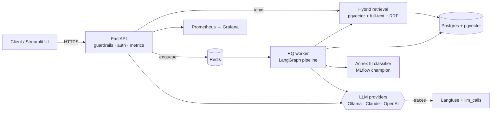
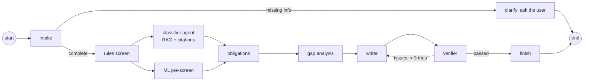

# EU AI Act Compliance Copilot

**Multi-agent RAG system that classifies AI systems under the EU AI Act and maps obligations, deadlines and gaps, built end to end from ingestion to production.**

FastAPI · LangGraph · PostgreSQL + pgvector · Redis/RQ · Ollama / Claude / OpenAI · scikit-learn + MLflow · Docker · GitHub Actions · Prometheus + Grafana · Langfuse

> Decision support, not legal advice. Every answer cites the regulation; every report is verified in code and must be reviewed by a qualified person.

<!-- Add a demo GIF here in Phase 9 -->

## What it does

- **Ask the AI Act** — questions answered only from the regulation, with citations verified in code (`POST /chat`, streaming at `/chat/stream`).
- **Assess an AI system** — describe a system; a team of agents profiles it, asks clarifying questions, screens it with rules and an ML model, classifies it with citations, looks up obligations and post-Omnibus deadlines, analyses gaps, writes a report and verifies it (`POST /assessments`).

## Architecture





Full design, phases and resume material: **[docs/BLUEPRINT.md](docs/BLUEPRINT.md)**

## Quick start

```bash
# 1. tools: Docker, uv (https://docs.astral.sh/uv/), make
make setup            # install dependencies, pre-commit, create .env
make test-phase P=0   # the provided infrastructure: should pass

# 2. services
make up               # Postgres/pgvector, Redis, Ollama, MLflow, Prometheus, Grafana, api, worker
make models           # pull llama3.1:8b + nomic-embed-text into Ollama (first time; ~5 GB)
make migrate

# 3. build it, phase by phase (see the table below)
make test-phase P=1
```

Mac users: run the Ollama app natively (Docker can't use the Mac GPU) and set `OLLAMA_HOST=http://host.docker.internal:11434` for the api and worker.

| URL | What |
|---|---|
| http://localhost:8000/docs | API (Swagger UI) |
| http://localhost:8501 | Streamlit UI (`make ui`) |
| http://localhost:5000 | MLflow |
| http://localhost:3000 | Grafana (dashboard "AI Act Copilot") |
| http://localhost:9090 | Prometheus |

## Build phases

| Phase | You build | Test |
|---|---|---|
| 0 | Run and read the provided infrastructure | `make test-phase P=0` |
| 1 | Parse the Act; legal-aware chunking; ingestion | `P=1`, then `make ingest` |
| 2 | Hybrid search (RRF), recall@k, MRR | `P=2`, then `make eval-retrieval` |
| 3 | Grounded answers, citation checks, guardrails, `POST /chat` | `P=3` |
| 4 | Rules screen, intake agent, classifier agent | `P=4` |
| 5 | Obligations, gaps, verifier, LangGraph orchestration | `P=5`, then try an assessment |
| 6 | MLOps: data, training, MLflow registry gate, drift | `P=6`, then `make train` |
| 7 | LLMOps: fallback, semantic cache, eval scoring | `P=7`, then `make evals` |
| 8 | Prometheus metrics; CI/CD; deploy; load test | `P=8`, then deploy |
| 9 | Results, docs, demo | — |

Every function to write is marked `# YOUR CODE` with a precise docstring. Tests use fakes (no services, no LLM calls) and run in seconds.

## Results

*Fill in as you go (Phase 9). These are your resume numbers.*

| Metric | Baseline | Final |
|---|---|---|
| Retrieval recall@5 (25 questions) | | |
| Scenario pass rate (20 scenarios) | | |
| Classifier macro F1 | | |
| p95 `/chat` latency · cost per 1k questions | | |

## Repository layout

```text
app/
  api/            FastAPI routes, dependencies, auth
  ingest/         fetch, parse (P1), chunk (P1), pipeline
  retrieval/      embeddings, stores (memory, Postgres), hybrid search (P2)
  rag/            grounded answers (P3), guardrails (P3)
  agents/         schemas, rules/intake/classifier (P4), obligations/gaps/writer/verifier/graph (P5)
  jobs/           assessment repository, queue, worker entry point
  mlops/          training (P6), registry gate (P6), drift (P6), serving
  llmops/         prompts, tracing, fallback (P7), cache (P7), eval scoring (P7)
  observability/  Prometheus metrics (P8)
prompts/          versioned prompt files
data/             obligations table, training data
evals/            retrieval eval set, assessment scenarios, runner
scripts/          ingest, retrieval eval, training data, training, drift check
tests/            one file per phase + integration tests
monitoring/       Prometheus config, Grafana provisioning + dashboard
.github/workflows CI (lint, tests, integration, eval gate, build), CD, weekly drift check
docs/             blueprint, model card, AI Act self-assessment, runbook
```

## License and disclaimer

Code: MIT (add a LICENSE file). The regulation text is © European Union, reusable under the Commission's reuse policy. This tool provides information, not legal advice.
